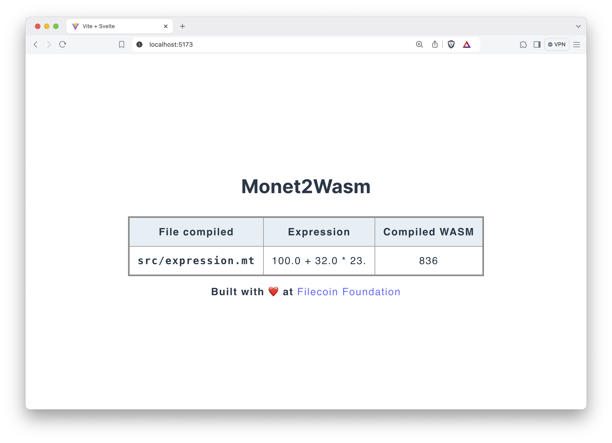

# monetlang

Monet targets Webassembly.

## play with monet

1. Runs the local web server that watches over the compiled WASM.

```shell
./monet web-server --port 9000
```

If `--port` or `-p` is left empty, the server will use the default port `5173`.

2. On the web browser, browse to `localhost:5173` and leave it open.

3. Create a monet file that ends with `.monet` or `.mt` and write a simple float expression, then save it.

```python
# basic.mt

32. + 40.1 * 3.14
```

4. Compile the file.

```shell
> ./monet compile basic.mt
>> "Compiled successfully"
```

5. Check the web browser out. The table will display the compiled monet file, compiled expression, and the emitted value in WASM.


